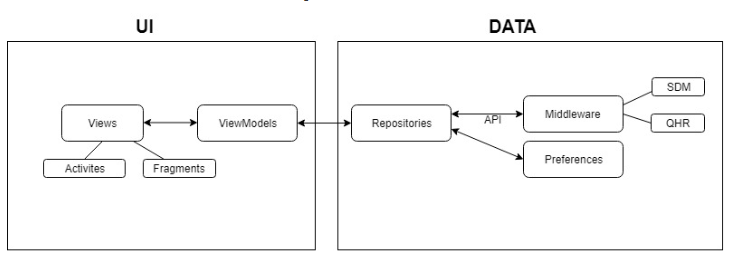
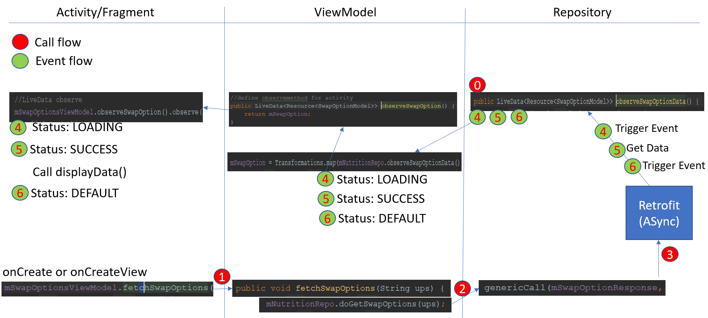

# Maple MMR2 Unit Test Guidelines

Maple (MMR2) uses "Structure-Based Testing Techniques-Modified Condition Decision Condition (MCDC) Testing" based on ISO/IEC/IEEE 29119 Software Testing.

Reference Site:
- [ISO/IEC/IEEE 29119 Software Testing](http://softwaretestingstandard.org/)
- [ISO/IEC/IEEE 29119-wikipedia](https://en.wikipedia.org/wiki/ISO/IEC_29119)
- [ISTQB® (International Software Testing Qualifications Board)](https://www.istqb.org)

Test Techniques
- [Modified condition/decision coverage-wikipedia](https://en.wikipedia.org/wiki/Modified_condition/decision_coverage)
- [ISO/IEC/IEEE 29119-4: Test Techniques](http://softwaretestingstandard.org/part4.php)

The Foundation Level Syllabus 2018
- [ISO/IEC/IEEE 29119-4: Test Techniques](https://www.istqb.org/downloads/send/51-ctfl2018/208-ctfl-2018-syllabus.html)

## 1. Objectives of Component(Unit) testing
Component testing (also known as unit or module testing) focuses on components that are separately
testable. Objectives of component testing include:
- Reducing risk
- Verifying whether the functional and non-functional behaviors of the component are as designed
and specified
- Building confidence in the component’s quality
- Finding defects in the component
- Preventing defects from escaping to higher test levels 

### 1.1 Test basis
Examples of work products that can be used as a test basis for component testing include:
- Detailed design
- Code
- Data model
- Component specifications

### 1.2 Test objects
Typical test objects for component testing include:
- Components, units or modules
- Code and data structures
- Classes
- Database modules

### 1.3 Typical defects and failures
Examples of typical defects and failures for component testing include:
- Incorrect functionality (e.g., not as described in design specifications)
- Data flow problems
- Incorrect code and logic 

### 1.4 Specific approaches and responsibilities
Component testing is usually performed by the developer who wrote the code, but it at least requires
access to the code being tested. Developers may alternate component development with finding and
fixing defects. Developers will often write and execute tests after having written the code for a component.


## 2. Test Design Techniques (White-box Test Techniques)
White-box testing is based on the internal structure of the test object.

### 2.1 Statement Testing and Coverage
Statement testing exercises the executable statements in the code. Coverage is measured as the number
of statements executed by the tests divided by the total number of executable statements in the test
object, normally expressed as a percentage.

### 2.2 Decision Testing and Coverage
Decision testing exercises the decisions in the code and tests the code that is executed based on the
decision outcomes. To do this, the test cases follow the control flows that occur from a decision point
(e.g., for an IF statement, one for the true outcome and one for the false outcome; for a CASE statement,
test cases would be required for all the possible outcomes, including the default outcome).
Coverage is measured as the number of decision outcomes executed by the tests divided by the total
number of decision outcomes in the test object, normally expressed as a percentage.

### 2.3 The Value of Statement and Decision Testing
When 100% statement coverage is achieved, it ensures that all executable statements in the code have
been tested at least once, but it does not ensure that all decision logic has been tested. Of the two whitebox
techniques discussed in here, statement testing may provide less coverage than decision
testing.
When 100% decision coverage is achieved, it executes all decision outcomes, which includes testing the
true outcome and also the false outcome, even when there is no explicit false statement (e.g., in the case
of an IF statement without an else in the code). Statement coverage helps to find defects in code that was
not exercised by other tests. Decision coverage helps to find defects in code where other tests have not
taken both true and false outcomes.
Achieving 100% decision coverage guarantees 100% statement coverage (but not vice versa). 


- JDK 1.8
- [Android SDK](http://developer.android.com/sdk/index.html).
- Min:Android 5.0(LOLLIPOP) [(API 21) ](http://developer.android.com/tools/revisions/platforms.html).
- Max:Android 8.0(Oreo) [(API 27) ](http://developer.android.com/tools/revisions/platforms.html).
- Latest Android SDK Tools and build tools.


## Why MCDC in Maple MMR2 
We can cover XXX coverage

This project follows MRR1's Android architecture guidelines that are based on [MVVM (Model-View-View Model)](https://en.wikipedia.org/wiki/Model%E2%80%93view%E2%80%93viewmodel). Read more about them [Guide to app architecture](https://developer.android.com/jetpack/docs/guide). 



### How to define the responsibilities of MVVM

 It is based on "Separation of concerns , Better testable, Follow SOLID principles' .

| MODEL Responsibilities |
| ------------------| 
| Retrofit         |
| Shared Preferences   | 


| VIEW(UI) Responsibilities |
| ------------------| 
| Working with android.view, android.widget, etc. |
| Showing Dialogs, Toasts, Snackbars   | 
| Event listeners*   | 
| Starting Activities*   | 
| Handling Menu   | 
| Handling permisstions   | 
| Other Android specific stuff & methods which require reference to the Activity Context | 
* Event Listeners is defined in the view.


| VIEWMODEL Responsibilities |
| ------------------| 
| Exposing state(progress, offline, empty, error,etc.)        |
| Exposing data*   | 
| Handling visibility   | 
| Handling Extras & Arguments(Bundle)   | 
| Input validation   | 
| Executing data calls in the Model   | 
| Executing UI commands in the View*   | 
* ViewModel layer should be separated from Android specific classes.
* ViewModel should use only the Application Context (start service , send broadcast, load resource values).

'*' it is changeable in this project.

p.s) reference : https://speakerdeck.com/petrnohejl/mvvm-architecture-on-android


### How to implement a new screen following MVVM

Imagine you have to implement a nutirition's some screen. 

1. Create a new package under `maple/ui/modules/` called `nutirition`
2. Create a new sub packages under `nutirition` 

| package           | description        | Example                      |
| ------------------| ----------------   | ---------------------------- |
| nutirition        | pillar             |                              |
|  - views          | activity           | `QuickRefillActivity`        |
|  -- fragments     | fragment           | `HistoryFragment`            |
|  - viewmodels     | viewmodel          | `PrescriptionsViewModel`     |
|  - models         | model              | `PrescriptionStatusCodes`    |
|  - interfaces     | interface          | `TransferStepValidation`     |
|  - bindingmodels  | bindingmodel        | `AddPharmacyBindingModel`   |
|  - adapter        | RecyclerViewAdapter | `HistoryAdapter`            |

3. Create an new screen for Activity or Fragment called `activity_xyz`,`fragment_xyz`. as a result binding file is generated
automatically `ActivityXyzBiding`.

```xml
//screen file: activity_xyz.xml

//define variable
<layout xmlns:android="http://schemas.android.com/apk/res/android">

    <data>
        <variable
            name="xyzViewModel"
            type="ca.shoppersdrugmart.maple.ui.modules.nutirition.viewmodels.XyzViewModel"/>
    </data>
 
 ...
 
 <include
    android:id="@+id/xyz_cta"
    layout="@layout/view_generic_button"
    android:layout_width="match_parent"
    android:layout_height="@dimen/default_button_height"
    android:layout_marginTop="@dimen/margin_xlarge"
    app:click='@{(v) -> xyzViewModel.loadData()}'
  ....   
          
```

4. Create an new ViewModel for Activity or Fragment called `XyzViewModel`. 
 
```java

    //define variable
    private final LiveData<Resource<XyzDataModel>> mXyz;

    //define observemethod for activity
    public LiveData<Resource<XyzDataModel>> observeXyz() {
            return mXyz;
    }

    //add Transformations.map to  in constructor
    public XyzViewModel() {
            mXyz = Transformations.map(mXyzRepo.observeXyzData(), xyz -> {
                mLoading.set(xyz.status == Status.LOADING);
                return xyz;
            });
    }

    //define method to call Repo
    public void loadData() {
            mXyzRepo.getLoadData();
    }

```

5. Create an new Activity called `XyzActivity`. You could also use a Fragment.

```java

public class XyzActivity extends BaseActivity<ActivityXyzBiding, XyzViewModel> {

    //view models
    private XyzViewModel mXyzViewModel;

    //onCreate
    @Override
    protected void onCreate(Bundle savedInstanceState) {
        super.onCreate(savedInstanceState);

        ....

        //LiveData observe 
        mXyzViewModel.observeXyz().observe(this, xyzDataModel ->{
           // do something..

        });
    }

    @Override
    public int getBindingVariable() {
        return BR.xyzViewModel;
    }

    @Override
    public int getLayoutId() {
        return R.layout.activity_xyz;
    }

    @Override
    public XyzViewModel getViewModel() {
        mXyzViewModel = ViewModelProviders.of(this).get(XyzViewModel.class);
        return mXyzViewModel;
    }


```
6. Create an new Java Class called `NutritionRepository`. You should add this to Dagger.

```java

public class NutritionRepository extends BaseRepository {

    private final MediatorLiveData<Resource<XyzDataModel>> mXyzResponse = new MediatorLiveData<>();
    private Observer<ApiResponse<XyzDataModel>> mXyzResponseObserver;

    private XyzDataModel mXyzDataModel = new XyzDataModel();

    public XyzRepository getXyzDataModel() {
        return mXyzDataModel;
    }

    public LiveData<Resource<XyzDataModel>> observeXyzData() {
        mXyzResponseObserver = xyzDataGenericModel -> {
            if (xyzDataGenericModel == null) return;
            mXyzDataModel = xyzDataGenericModel.body;
        };

        return mXyzResponse;
    }

    //if there are parameters..
    //public void getLoadData(..param1,..param2,...) {
    //esle no paramters
    public void getLoadData() {

        //.. set parameter
        XyzPayload payload = new XyzPayload();
        payload.param1 = param1;
        payload.param2 = param2;
        
        genericCall(mXyzResponse, mApi.getNutritionService().getData(payload),mXyzResponseObserver);
    }
```

7. Add an new Interface Class called `NutritionService`
```java

public interface NutritionService {

    ...

    @GET("xxx/yyyy")
    LiveData<ApiResponse<XyzDataModel>> getData();

    ...
}
    
```


8. Update method called `getNutritionService()` at ApiController(../data/sources/remote/rest).

```java

public class ApiController {
    ...
    //add
    private NutritionService mNutritionService;
    ...
    //update mBaseUrlNutrition
    private String mBaseUrlMaple, mBaseUrlMedeo, mBaseUrlOkta, mBaseUrlNutrition;
    ...
    
    //update String nutritionBaseUrl
    public void init(final Context context, String mapleBaseUrl, String medeoBaseUrl, String oktaBaseUrl, 
String nutritionBaseUrl, String environment) {
    
    ...
    //add
    mBaseUrlNutrition = nutritionBaseUrl;
    ...
    
    //add
    mNutritionService = buildService(mBaseUrlNutrition).create(NutritionService.class);
    
    }
    
    //add
    public NutritionService getNutritionService() {
        return mNutritionService;
    }
    
```

9. Add method called `provideNutritionRepository()` at RepositoriesModule(../data/di/module).

```java

   @Singleton
   @Provides
   public NutritionRepository provideNutritionRepository(){
      return new NutritionRepository();
   }
   
```

10. Call & Event Flow.



## Code Quality

This project integrates a combination of unit tests, functional test and code analysis tools. 

### Tests

To run **unit** tests on your machine:

``` 
./gradlew test
``` 

To run **functional** tests on connected devices:

``` 
./gradlew connectedAndroidTest
``` 

Note: For Android Studio to use syntax highlighting for Automated tests and Unit tests you **must** switch the Build Variant to the desired mode.

### Code Analysis tools 

The following code analysis tools are set up on this project:

* [PMD](https://pmd.github.io/): It finds common programming flaws like unused variables, empty catch blocks, unnecessary object creation, and so forth. See [this project's PMD ruleset](config/quality/pmd/pmd-ruleset.xml).

``` 
./gradlew pmd
```

* [Findbugs](http://findbugs.sourceforge.net/): This tool uses static analysis to find bugs in Java code. Unlike PMD, it uses compiled Java bytecode instead of source code.

```
./gradlew findbugs
```

* [Checkstyle](http://checkstyle.sourceforge.net/): It ensures that the code style follows [our Android code guidelines](https://github.com/ribot/android-guidelines/blob/master/project_and_code_guidelines.md#2-code-guidelines). See our [checkstyle config file](config/quality/checkstyle/checkstyle-config.xml).

```
./gradlew checkstyle
```

### The check task

To ensure that your code is valid and stable use check: 

```
./gradlew check
```

This will run all the code analysis tools and unit tests in the following order:


 


