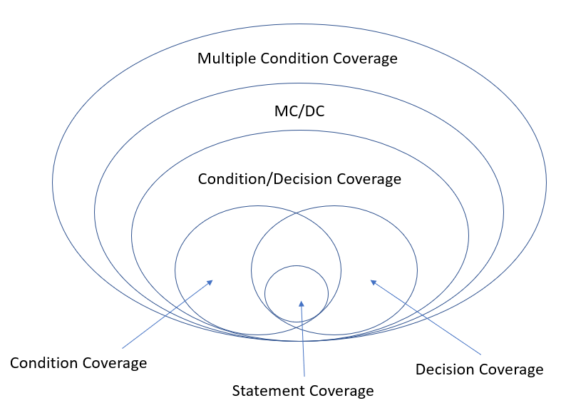

# Maple MMR2 Unit Test Guidelines

Maple (MMR2) uses "Structure-Based Testing Techniques-Modified Condition Decision Condition (MC/DC) Testing" based on ISO/IEC/IEEE 29119 Software Testing.

Reference Site:
- [ISO/IEC/IEEE 29119 Software Testing](http://softwaretestingstandard.org/)
- [ISO/IEC/IEEE 29119-wikipedia](https://en.wikipedia.org/wiki/ISO/IEC_29119)
- [ISTQB® (International Software Testing Qualifications Board)](https://www.istqb.org)

Test Techniques
- [Modified condition/decision coverage-wikipedia](https://en.wikipedia.org/wiki/Modified_condition/decision_coverage)
- [ISO/IEC/IEEE 29119-4: Test Techniques](http://softwaretestingstandard.org/part4.php)
- [The Foundation Level Syllabus 2018 of ISTQB](https://www.istqb.org/downloads/send/51-ctfl2018/208-ctfl-2018-syllabus.html)

## 1. Objectives of Component(Unit) testing
Component testing (also known as unit or module testing) focuses on components that are separately
testable. Objectives of component testing include:
- Reducing risk
- Verifying whether the functional and non-functional behaviors of the component are as designed
and specified
- Building confidence in the component’s quality
- Finding defects in the component
- Preventing defects from escaping to higher test levels 

### 1.1 Test basis
Examples of work products that can be used as a test basis for component testing include:
- Detailed design
- Code
- Data model
- Component specifications

### 1.2 Test objects
Typical test objects for component testing include:
- Components, units or modules
- Code and data structures
- Classes
- Database modules

### 1.3 Typical defects and failures
Examples of typical defects and failures for component testing include:
- Incorrect functionality (e.g., not as described in design specifications)
- Data flow problems
- Incorrect code and logic 

### 1.4 Specific approaches and responsibilities
Component testing is usually performed by the developer who wrote the code, but it at least requires
access to the code being tested. Developers may alternate component development with finding and
fixing defects. Developers will often write and execute tests after having written the code for a component.

## 2. Test Design Techniques (White-box Test Techniques)
White-box testing is based on the internal structure of the test object.

### 2.1 Statement Testing and Coverage
Statement testing exercises the executable statements in the code. Coverage is measured as the number
of statements executed by the tests divided by the total number of executable statements in the test
object, normally expressed as a percentage.

### 2.2 Decision Testing and Coverage
Decision testing exercises the decisions in the code and tests the code that is executed based on the
decision outcomes. To do this, the test cases follow the control flows that occur from a decision point
(e.g., for an IF statement, one for the true outcome and one for the false outcome; for a CASE statement,
test cases would be required for all the possible outcomes, including the default outcome).
Coverage is measured as the number of decision outcomes executed by the tests divided by the total
number of decision outcomes in the test object, normally expressed as a percentage.

### 2.3 The Value of Statement and Decision Testing
When 100% statement coverage is achieved, it ensures that all executable statements in the code have
been tested at least once, but it does not ensure that all decision logic has been tested. Of the two whitebox
techniques discussed in here, statement testing may provide less coverage than decision
testing.
When 100% decision coverage is achieved, it executes all decision outcomes, which includes testing the
true outcome and also the false outcome, even when there is no explicit false statement (e.g., in the case
of an IF statement without an else in the code). Statement coverage helps to find defects in code that was
not exercised by other tests. Decision coverage helps to find defects in code where other tests have not
taken both true and false outcomes.
Achieving 100% decision coverage guarantees 100% statement coverage (but not vice versa). 

### 2.4 Why MC/DC in Maple MMR2 
Mutiple condition coverage is ideally best, but it may make so many test case, so we select the next strong coverage level of it.
Usually,

## 3. How to define the Test Case

### 3.1 Input Field Validation Check case
- 다중조건 커버리지 내용 참고 (169)

### 3.2 CRUD case
### 3.2.1 Read data case
  - 데이터 로드를 하고 표시하는 부분에 대한 처리
  - Junit 관련해서도 넣어야 한다?
### 3.2.2 Create/Udate/Delete data case
   - 데이터를 저장하고 표시하는 부분에 대한 처리
   - Junit 관련해서도 넣어야 한다?
   
#### 참고사이트
아래에 나온 제어 흐름도 처럼
테스트 경로를 찾은 다음에 만들면 될것 같ㅅ다.
http://www.jidum.com/jidums/view.do?jidumId=590

화면이 열리면 데이터를 호출하고, 데이터가
있으면 보여주고, 없으면 안보여 준다.

를 위해서 테스트 케이스는
호출-있다-보여준다
호출-없다-안보여준다

이게..다다.. 맞는지..확인 필요하다.

#### 다음
https://www.slideshare.net/genycho/ss-64153730

#### 다음2 - 외국인이 정리한데
https://www.softwaretestinghelp.com/white-box-testing-techniques-with-example/

#### 다음3 - 외국인이 정리한데
https://www.scribd.com/doc/82088753/TestCase%EC%84%A4%EA%B3%84

http://blog.naver.com/PostView.nhn?blogId=suresofttech&logNo=220845981593&parentCategoryNo=&categoryNo=101&viewDate=&isShowPopularPosts=false&from=postView

https://blog.naver.com/suresofttech/220636029506

https://www.itpedia.nl/ko/2018/06/01/testcases-voorbeelden-en-best-practices/

http://www.splex.co.kr/black-white-box-test?ckattempt=1

테스트 방법 (whitebox test)
- 구조기반 기법 중에 제어흐름 테스트 기법 써서
  분기문을 중심으로 한 테스트를 수행하게 한다.

개발자니까..화이트 박스 테스트를 해야 한다.
그중에서도 제어 흐름을 비교 하게 한다.

Junit 에서 어떤것을 지원하는지를 잘 보고 판단해야 한다.

#### 다음 4
https://brunch.co.kr/@oemilk/76

