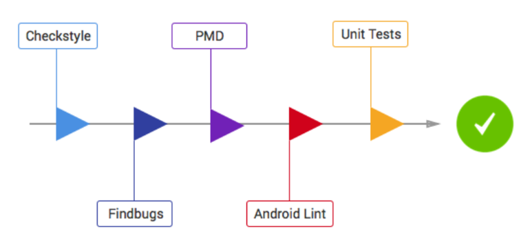
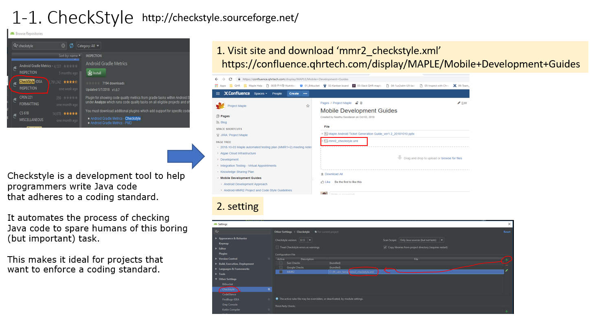
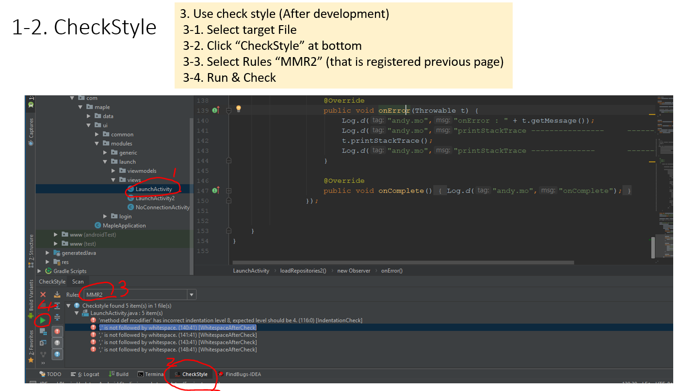
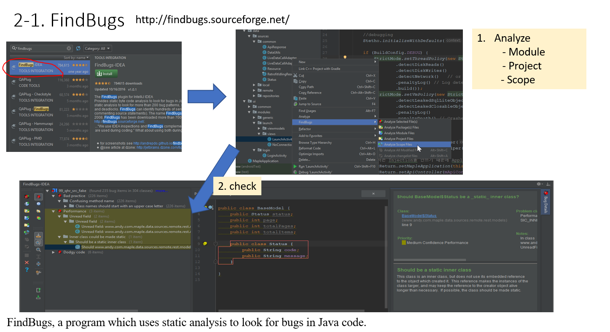
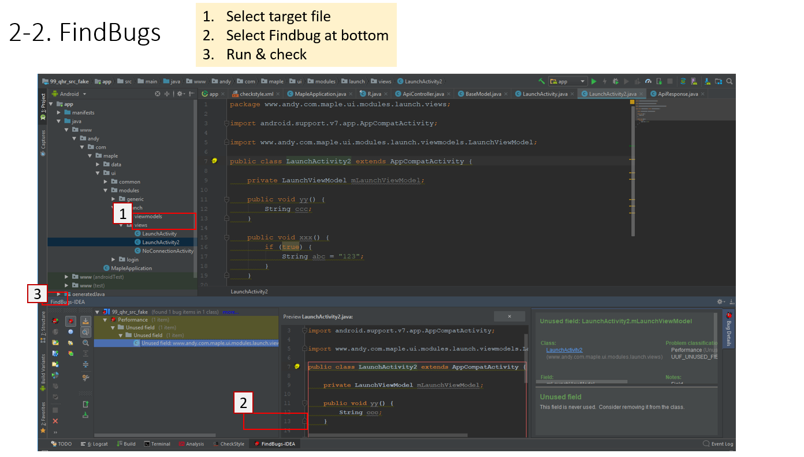
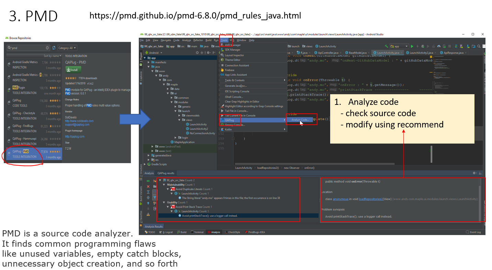
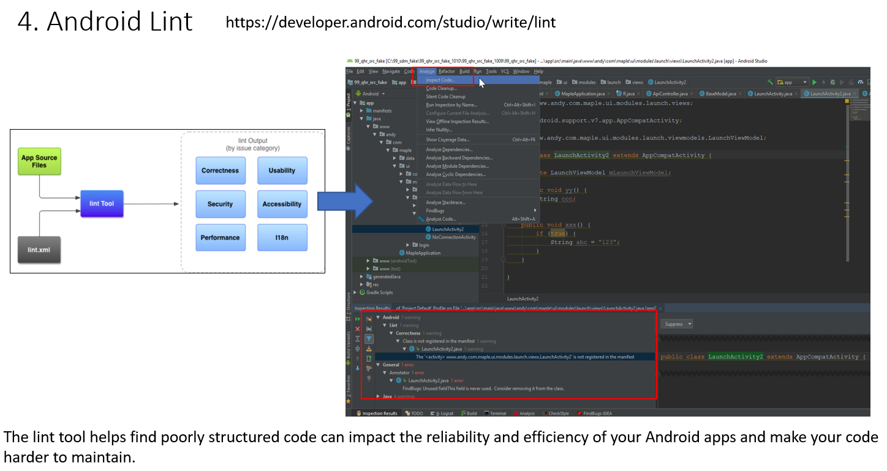

# Maple MMR2 Static Analysis Guidelines

Maple (MMR2) uses 4 steps static analysis for code before unit test.

tools included:

- [CheckStyle](http://checkstyle.sourceforge.net/)
- [FindBugs](http://findbugs.sourceforge.net/)
- [PMD](https://pmd.github.io/pmd-6.8.0/pmd_rules_java.html)
- [Android Lint](https://developer.android.com/studio/write/lint)

## CheckStyle
Checkstyle is a development tool to help programmers write Java code that adheres to a coding standard.

## FindBugs
FindBugs, a program which uses static analysis to look for bugs in Java code.

## PMD
PMD is a source code analyzer. It finds common programming flaws like unused variables, empty catch blocks, 
unnecessary object creation, and so forth

## Android Lint
The lint tool helps find poorly structured code can impact the reliability and efficiency of your Android apps and 
make your code harder to maintain.

